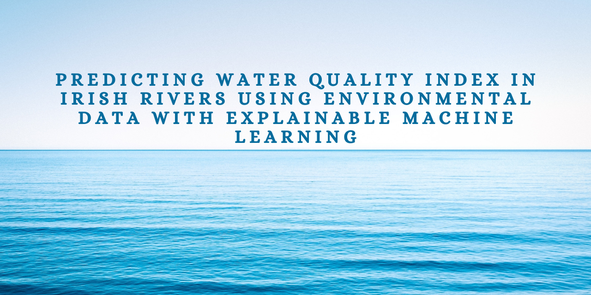
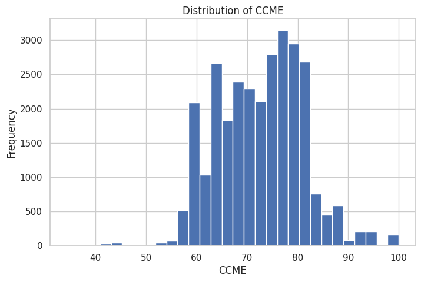
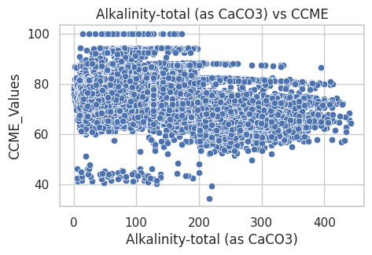
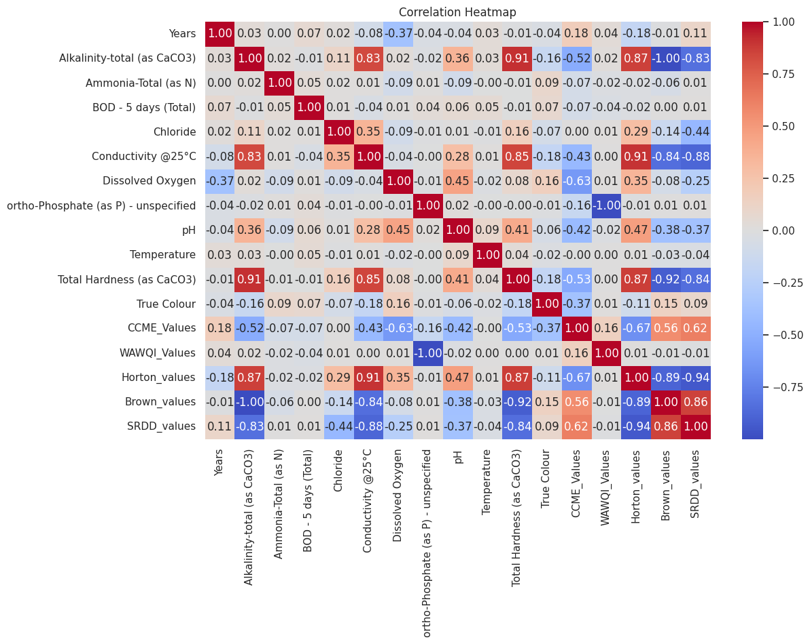
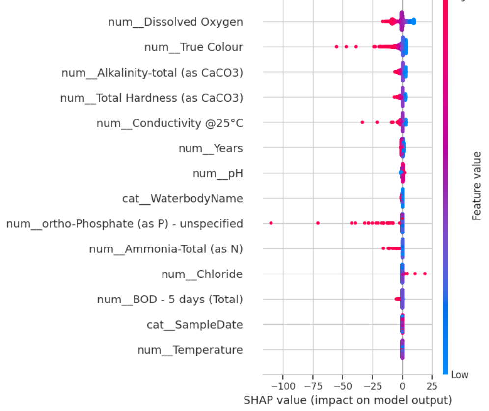
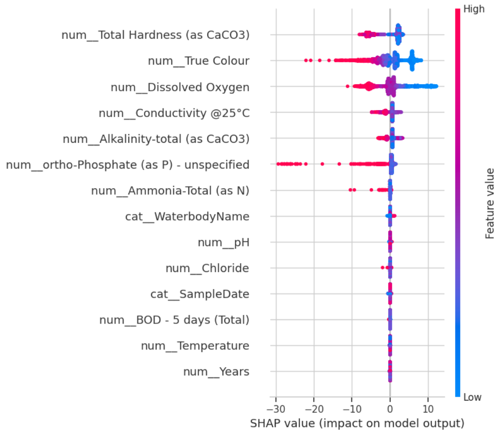
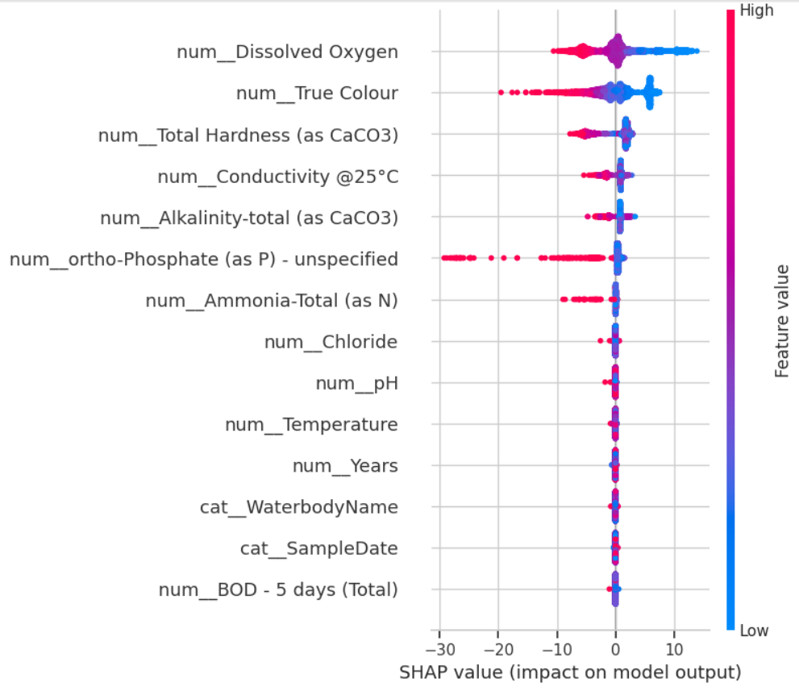

<p align="center">
  
</p>

<p align="center">


</p>

# Predicting Water Quality Index in Irish Rivers with Explainable Machine Learning

## Overview

Water Quality Index (WQI) is a critical indicator used to evaluate the ecological health of river systems. This project develops machine learning models capable of accurately predicting the Water Quality Index of Irish rivers using physicochemical water quality measurements.

The study compares the performance of three regression models:

* Linear Regression
* Random Forest Regressor
* XGBoost Regressor

To improve transparency and interpretability, SHAP (SHapley Additive exPlanations) was applied to explain model predictions and identify the environmental factors that most strongly influence river water quality.

---

## Project Objectives

* Predict Water Quality Index (WQI) using machine learning techniques.
* Compare the performance of multiple regression algorithms.
* Identify the most influential environmental parameters affecting water quality.
* Apply Explainable AI (XAI) techniques for model transparency.
* Provide an interpretable framework for environmental monitoring and decision-making.

---

## Dataset

**Dataset Source**

Water Quality Monitoring Dataset (Ireland)

https://figshare.com/articles/dataset/Water_Quality_Monitoring_Dataset_Ireland_/25002131

### Dataset Characteristics

* 29,159 water quality records
* Irish river monitoring stations
* Data collected between 2007 and 2023
* Physicochemical water quality measurements
* Multiple Water Quality Index formulations

### Key Features

* Alkalinity-total (as CaCO₃)
* Ammonia-Total (as N)
* BOD - 5 days (Total)
* Chloride
* Conductivity @25°C
* Dissolved Oxygen
* ortho-Phosphate (as P)
* pH
* Temperature
* Total Hardness (as CaCO₃)
* True Colour

### Target Variable

* CCME Water Quality Index (WQI)

---

## Project Architecture

<p align="center">
  
</p>

---

## Machine Learning Workflow

1. Data Collection
2. Data Cleaning and Preprocessing
3. Label Encoding
4. Standard Scaling
5. Train-Test Split
6. Model Training
7. Hyperparameter Optimization using GridSearchCV
8. Performance Evaluation
9. SHAP Explainability Analysis
10. Result Interpretation

---

## Models Developed

### Linear Regression

A baseline regression model used to evaluate linear relationships between environmental parameters and WQI.

### Random Forest Regressor

An ensemble learning approach capable of capturing nonlinear relationships and interactions among water quality parameters.

### XGBoost Regressor

A gradient boosting model designed to achieve high predictive accuracy while handling complex environmental datasets.

---

## Model Performance

| Model             | R² Score | RMSE   | MAE    |
| ----------------- | -------- | ------ | ------ |
| Linear Regression | 0.8330   | 3.4931 | 2.5979 |
| Random Forest     | 0.9901   | 0.8490 | 0.4661 |
| XGBoost           | 0.9968   | 0.4839 | 0.1485 |

**Best Performing Model: XGBoost Regressor**

---

## Key Findings

* Ensemble learning models significantly outperformed the baseline Linear Regression model.
* XGBoost achieved the highest predictive performance with an R² score of 0.9968.
* Water quality prediction involves complex nonlinear relationships that are effectively captured by tree-based ensemble models.
* Explainable AI techniques successfully identified the most influential environmental factors affecting WQI.

---

## Exploratory Data Analysis

### Distribution of Water Quality Index



### Distribution of Water Quality Index



### Correlation Analysis



---

## Explainable AI (SHAP)

SHAP (SHapley Additive exPlanations) was applied to interpret the predictions generated by the machine learning models.

### SHAP Analysis – Linear Regression



### SHAP Analysis – Random Forest



### SHAP Analysis – XGBoost



---

## Repository Structure

```text
Predicting-Water-Quality-Index-in-Irish-Rivers-with-Explainable-Machine-Learning
│
├── README.md
├── requirements.txt
│
├── images/
│   ├── github_banner.png
│   └── project_architecture.png
│
├── notebooks/
│   └── Fullcode.ipynb
│
├── models/
│   ├── linear_pipeline.pkl
│   ├── rf_pipeline.pkl
│   └── xgb_pipeline.pkl
│
├── results/
│   ├── model_comparison.png
│   ├── correlation_heatmap.png
│   ├── distribution_ccme.png
│   ├── shap_linear.png
│   ├── shap_rf.png
│   └── shap_xgb.png
│
├── report/
│   └── Final_Report.pdf
│
└── data/
```

---

## Installation

Clone the repository:

```bash
git clone https://github.com/jenyokeke123-sketch/Predicting-Water-Quality-Index-in-Irish-Rivers-with-Explainable-Machine-Learning.git
```

Install dependencies:

```bash
pip install -r requirements.txt
```

---

## Running the Project

Open the notebook:

```bash
jupyter notebook Fullcode.ipynb
```

Run all cells sequentially to:

* Preprocess the dataset
* Train machine learning models
* Evaluate model performance
* Generate SHAP explanations

---

## Trained Models

The repository includes pre-trained machine learning pipelines:

* linear_pipeline.pkl
* rf_pipeline.pkl
* xgb_pipeline.pkl

These models can be loaded directly for inference without retraining.

---

## Research Report

The complete MSc research report is available in:

```text
report/Final_Report.pdf
```

---

## Applications

* Environmental Monitoring
* River Health Assessment
* Water Resource Management
* Pollution Detection
* Environmental Policy Support
* Sustainable Water Governance

---

## Future Enhancements

* Real-time water quality prediction
* Integration with IoT water sensors
* Geospatial visualization of river health
* Time-series forecasting of WQI
* Web-based prediction dashboard deployment

---

## Author

Michelle Obi

MSc Research Project

Predicting Water Quality Index in Irish Rivers with Explainable Machine Learning

---

## License

This project is licensed under the MIT License.
